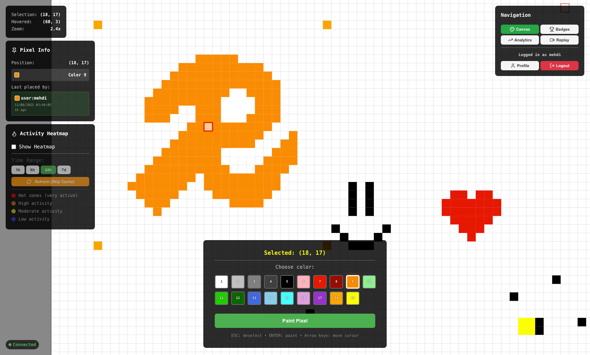
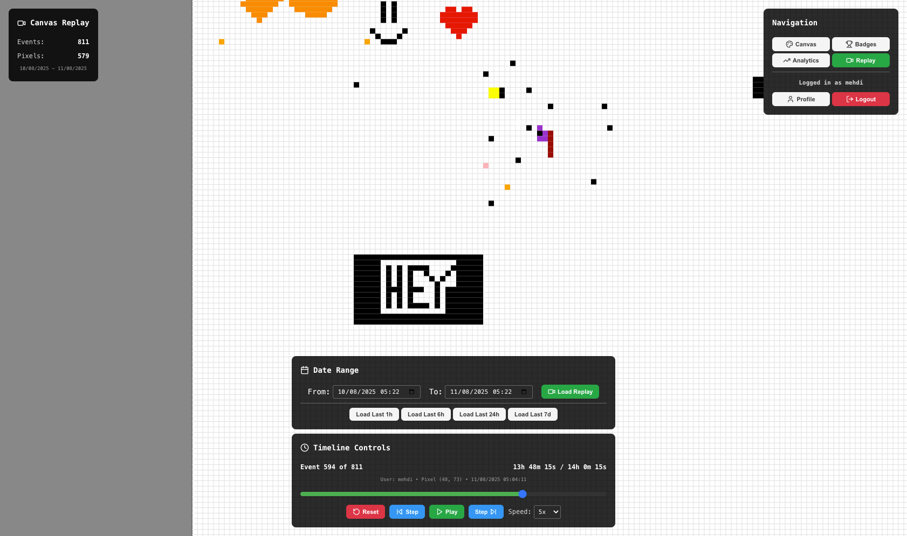
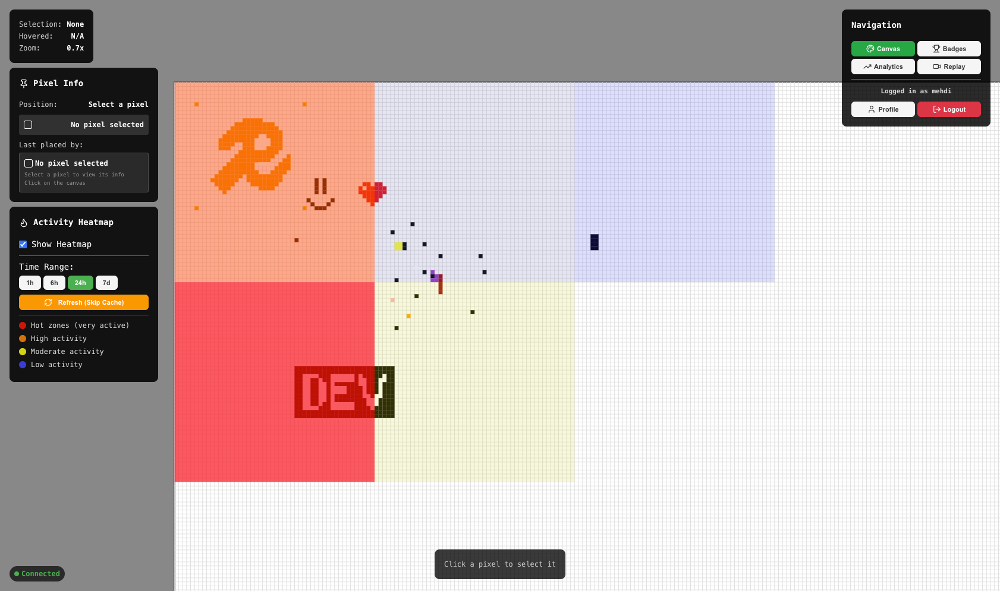
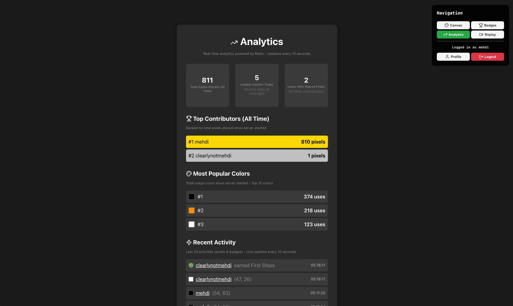

# Redis Place: Building r/place with 9 Redis Data Structures

_This is a submission for the [Redis AI Challenge](https://dev.to/challenges/redis-2025-07-23): Beyond the Cache_.

## What I Built

Redis Place is a collaborative pixel art canvas inspired by Reddit's r/place, where users can paint on a shared 1000x1000 canvas in real-time. But here's the twist: **every single feature is powered by Redis as the primary database** - no traditional database in sight!

What makes this project special:

- 🎨 **Real-time collaboration** with instant pixel updates across all users
- 📊 **Advanced analytics dashboard** with live user leaderboards and activity feeds
- 🔄 **Time-travel replay system** to watch the canvas evolve from the first pixel
- 🗺️ **Activity heatmaps** showing hot zones across different time ranges
- 🏆 **Achievement system** with automated badge awarding
- ⚡ **Ultra-optimized performance** with Redis pipelines and intelligent caching

The entire application demonstrates Redis capabilities far beyond caching - it's a comprehensive data platform handling everything from pixel storage to user authentication, analytics, and real-time messaging.

## Tech Stack

- Frontend: Vite + React
- Backend: Node.js + Socket.io + Redis 8

## Demo

- 🚀 **Live Demo**: https://redisplace.mehdi.co/
- 🐙 **Source Code**: https://github.com/mehdiamrane/redis-place

### Key Features Showcase:

**Main Canvas:**

_Real-time collaborative pixel art_

**Time-Travel Replay:**
  
_Watch the canvas evolve over time with chronological event reconstruction_

**Activity Heatmap:**

_Visual overlay showing activity hot zones with time-based filtering_

**Analytics Dashboard:**  

_User leaderboards, statistics, and activity feed_

**User Profile:**

_User profile with statistics and badges_

## How I Used 9 Redis Data Structures in Redis 8

This project pushes Redis beyond caching into **primary database territory**, leveraging 9 different Redis data structures to create a feature-rich collaborative application:

### 1. 🔢 **Bitfields: Ultra-Efficient Pixel Storage**

```typescript
// Store 1M pixels in just 625KB using 5-bit encoding per pixel
const bitOffset = (y * 1000 + x) * 5;
await redis.bitfield("canvas:pixels", "SET", "u5", bitOffset, colorId);
```

- **Challenge**: Store 1M pixels efficiently
- **Solution**: Each pixel uses 5 bits (32 color IDs), reducing memory from ~4MB to 625KB
- **Impact**: 85% memory reduction with instant pixel access

### 2. 📡 **Pub/Sub: Real-Time Collaboration**

```typescript
// Instant pixel updates across all connected users
await redis.publish("canvas:updates", JSON.stringify({ x, y, color, userId }));
```

- **Real-time broadcasting** of pixel changes to all connected clients
- **Decoupled architecture** separating storage from notifications
- **Instant synchronization** across unlimited concurrent users

### 3. 🏆 **Sorted Sets: Dynamic Leaderboards**

```typescript
// Increment user's pixel count
await redis.zincrby("leaderboard:users", 1, userId);
// Get top 10 users with most pixels
const topUsers = await redis.zrevrange("leaderboard:users", 0, 9, "WITHSCORES");
```

- **Automatic ranking** without complex sorting algorithms
- **Efficient range queries** for top N users
- **Real-time score updates** with each pixel placement

### 4. 📊 **HyperLogLog: Probabilistic Analytics**

```typescript
// Add user ID to daily visitor set
await redis.pfadd(`visitors:daily:${date}`, userId);
// Count unique daily visitors with constant memory
const uniqueVisitors = await redis.pfcount(`visitors:daily:${date}`);
```

- **Memory-efficient counting** of unique values
- **Daily visitor tracking** with minimal overhead

### 5. 🌊 **Streams: Event Sourcing & Time Travel**

```typescript
// Complete event history for replay feature
await redis.xadd("stream:activity", "*", "userId", userId, "x", x, "y", y, "color", color);

// Time-based filtering for canvas replay
const events = await redis.xrange("stream:activity", startTime, endTime);
```

- **Complete event history** for every pixel placement
- **Time-based filtering** using native Redis timestamps
- **Canvas reconstruction** by replaying events chronologically

### 6. 🗃️ **JSON Documents: Rich User Profiles and Rate Limiting**

```typescript
// Structured user data with atomic updates
await redis.call(
  "JSON.SET",
  `userprofile:${userId}`,
  "$",
  JSON.stringify({
    pixelsPlaced: 150,
    favoriteColor: calculateFavorite(colorUsage),
    colorUsage: { "1": 45, "5": 30, "12": 15 },
    badges: ["first_pixel", "color_master"],
  })
);

// Rate limiting using JSON profiles
const profileData = await redis.call("JSON.GET", profileKey, "$.lastPixelTime");
if (timeSinceLastPixel < backendCooldownMs) {
  socket.emit("rate-limited", { remainingSeconds });
}
```

- **Atomic profile updates** in a single operation
- **Complex data structures** with nested objects and arrays
- **Automatic favorite color calculation** from usage patterns
- **Badge system integration** with real-time achievements
- **Rate limiting** using JSON profiles with lastPixelTime field

### 7. ⏱️ **Time Series: Activity Heatmaps**

```typescript
// Track activity zones with time-based aggregation
await redis.call("TS.CREATE", `heatmap:${zoneX}:${zoneY}`, "RETENTION", 604800000);
await redis.call("TS.ADD", `heatmap:${zoneX}:${zoneY}`, Date.now(), 1);

// Query with time ranges for dynamic heatmaps
const activity = await redis.call("TS.RANGE", `heatmap:${x}:${y}`, fromTime, "+");
```

- **400-zone grid** tracking (400 areas of 50x50 pixels zones across 1000x1000 pixels canvas)
- **7-day retention** with automatic expiration
- **Pipeline optimization** reducing 30s queries to 180ms
- **5-minute caching** further improving performance to 90ms when cache hits

### 8. 🗂️ **Hashes: Authentication & Statistics**

```typescript
// Storing user credentials
await redis.hset(`user:${username}`, "password", bcryptHash, "createdAt", timestamp);
// Incrementing global color usage statistics
await redis.hincrby("stats:colors", colorId, 1);
```

- **Secure credential storage** with bcrypt hashing
- **Global color statistics** with atomic increments
- **Efficient field-based operations** for related data

### 9. 🎯 **Strings: Intelligent Caching and Session Management**

```typescript
// Event-driven cache invalidation
await redis.set("canvas:snapshot:cache", JSON.stringify(snapshot));
// Clear on pixel changes
await redis.del("canvas:snapshot:cache");

// 30-day sliding sessions with automatic renewal
await redis.setex(`session:${token}`, 2592000, username);
// Validate session against logged-in username
const username = await redis.get(`session:${sessionToken}`);
```

- **Smart cache invalidation** only when canvas changes
- **Race condition handling** with polling mechanisms
- **Performance boost**: 4s generation → instant cached loads
- **Sliding expiration** for sessions, refreshed on activity

## Performance Optimizations That Matter

### Canvas Loading: 500x Performance Improvement

- **Before**: 20+ seconds for full canvas load
- **After**: 4 seconds (first load), instant (cached)
- **Technique**: 50K-operation pipelines (50k operations max. to prevent stack overflow) + intelligent Redis caching

### Heatmap Queries: 165x Faster

- **Before**: 30 seconds for 400 zone queries
- **After**: 180ms (pipelines) → 90ms (with cache)
- **Technique**: Pipeline batching + 5-minute Redis cache layer

### Canvas Storage Efficiency: 85% Reduction

- **Traditional approach**: ~4MB for 1M pixels
- **Bitfield approach**: 625KB for same data
- **Bonus**: Room for 32 color states because of 5-bit encoding

## Conclusion - Redis is not just a cache

This project proves Redis isn't just a cache - it's a complete data platform:

✅ **Primary Database**: No other database needed  
✅ **Real-Time Engine**: Pub/Sub for instant collaboration  
✅ **Analytics Platform**: Multiple data structures for complex queries  
✅ **Event Store**: Complete history with Streams  
✅ **Session Store**: Secure authentication with sliding expiration

<!-- Team Submissions: Please pick one member to publish the submission and credit teammates by listing their DEV usernames directly in the body of the post. -->

<!-- Don't forget to add a cover image (if you want). -->

<!-- Thanks for participating! -->

<!--  ⚠️ By submitting this entry, you agree to receive communications from Redis regarding products, services, events, and special offers. You can unsubscribe at any time. Your information will be handled in accordance with [Redis's Privacy Policy](https://redis.io/legal/privacy-policy/). -->
